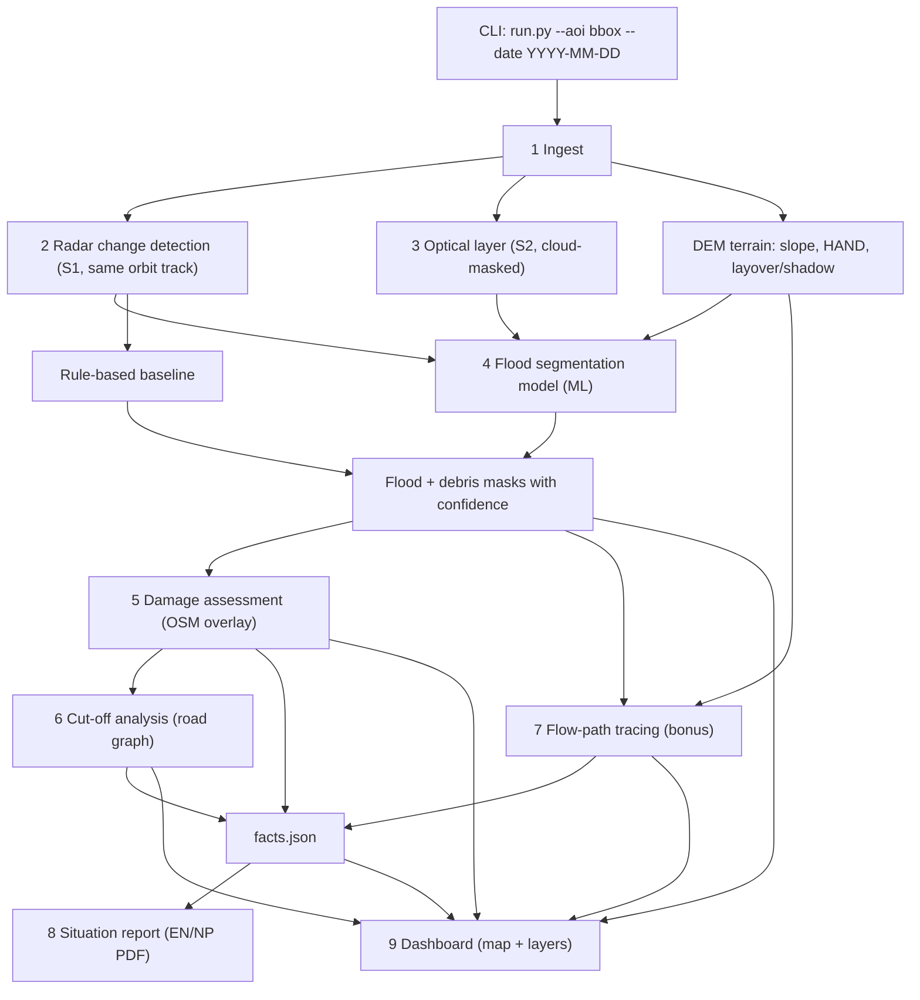

# Setu Flood Mapping: System Architecture

Educational prototype for the Space Track hackathon (Trishuli valley, Nepal). Submission deadline: **15 Oct 2026**.

**One-line summary:** given an area and a date, the system takes raw Sentinel-1/2, Copernicus DEM and pre-event OpenStreetMap data and produces (1) flood and debris maps, (2) damaged buildings/roads/bridges, (3) settlements cut off from the nearest town or hospital, (4) an interactive dashboard, and (5) a one-page situation report. Every number in the report comes from the maps.

> Status legend used below: **[done]** working now, **[wip]** in progress, **[todo]** not started.

---

## 1. Design principles

1. **Parameterized end to end.** Judges choose the area and date live. Nothing is hardcoded to Trishuli.
2. **Data rules first.** Only allowed inputs (Sentinel-1/2, Copernicus DEM, pre-event OSM, the listed training sets). Copernicus EMS / EMSR927 and other damage maps are **check-only** and never enter training or the pipeline.
3. **Kaggle is a GPU box, not the workspace.** Code lives in GitHub. Inference runs outside Kaggle.
4. **Baseline first, model second.** A rule-based baseline is the yardstick the ML model must beat, and we report by how much.
5. **Every claim has a number, every number has a source.** The report reads only from `facts.json`.
6. **Honest about limits.** Uncertainty tiers, fallbacks, and a candid limitations section.

---

## 2. Pipeline overview



---

## 3. Repository layout

```
Setu-Flood-Mapping/
├── run.py                      # CLI entry point (skeleton exists)
├── README.md
├── ATTRIBUTION.md              # verbatim attribution strings + dataset citations
├── ARCHITECTURE.md             # this file
├── configs/
│   └── default.yaml            # thresholds, paths, model settings
├── src/
│   ├── ingest/
│   │   ├── cdse.py             # [done] CDSE search
│   │   ├── dem.py              # [todo] Copernicus DEM fetch
│   │   └── osm.py              # [todo] ohsome pull, snapshot pinned <= 27 Jul 2026
│   ├── radar/
│   │   ├── s1_openeo.py        # [done] S1 fetch via openEO
│   │   ├── change.py           # [done] same-track change maps
│   │   ├── baseline.py         # [done] rule-based two-track mask
│   │   └── terrain.py          # [todo] slope, HAND, layover/shadow mask
│   ├── optical/
│   │   └── s2.py               # [todo] SCL cloud mask, MNDWI/NDWI, debris index
│   ├── model/
│   │   ├── dataset.py          # [todo] Kuro Siwo loader, mountain hold-out split
│   │   ├── train.py            # [todo] U-Net training (runs on Kaggle)
│   │   ├── infer.py            # [todo] tiled inference, runs anywhere
│   │   └── metrics.py          # [todo] IoU, F1, precision, recall
│   ├── damage/
│   │   └── overlay.py          # [todo] buildings/roads/bridges vs mask
│   ├── access/
│   │   └── cutoff.py           # [todo] road graph, re-routing, cut-off villages
│   ├── hydro/
│   │   └── flowpath.py         # [todo] bonus: downstream flow path
│   ├── report/
│   │   ├── facts.py            # [todo] builds facts.json
│   │   └── render.py           # [todo] EN/NP one-page PDF
│   ├── dashboard/
│   │   └── app.py              # [todo] map UI
│   └── validation/
│       ├── compare_emsr.py     # [todo] EMSR927 check-only comparison
│       └── provenance.py       # [todo] data-provenance log
├── notebooks/                  # Kaggle bootstrap + training notebooks
├── tests/
└── outputs/                    # git-ignored: rasters, reports, caches
```

Git-ignore all rasters, `*.db`, `*.parquet`, `*.npy` and cache folders. GitHub rejects files over 100 MB.

---

## 4. Module specifications

### 4.1 Ingest [done / todo]
- **In:** AOI (bbox or GeoJSON), event date.
- **Out:** S1 scene stack (VV, VH), S2 scenes, DEM, OSM extract, all on one common 10 m grid.
- **Rules:** cache locally (judging is live and downloads are slow), retry on failure, cap AOI size, log every dataset used to the provenance log.

### 4.2 Radar change detection [done]
- **Same orbit track only.** Pre and post images come from the same relative orbit, about 12 days apart. Never mix tracks.
- Change map in dB per polarization. Regional haze removed with a large-window mean, then scaled by robust sigma.
- **Baseline mask:** VV drop beyond 3 sigma with VH agreeing at 1.5 sigma. Classes: decrease/increase, one track or both tracks.
- **Current result (old box, o85 + o19):** about 0.52 km² decrease in both tracks (high confidence), about 3 km² in one track. The mask follows the river corridor and leaves hillsides clean.
- **Open item:** track o121 disagrees with o85 and o19 (its decrease mask is about 0.3 km² with zero overlap on o85). Diagnose it; if it is a geometry or surface-state problem, use it as a supporting track only and document it in the limitations.

### 4.3 Terrain layers [todo]
- Slope and HAND (height above nearest drainage) from the Copernicus DEM.
- Layover/shadow mask per track. Steep-slope pixels are flagged so they cannot create false floods.

### 4.4 Optical layer [todo]
- Sentinel-2 cloud and shadow mask (SCL band), MNDWI/NDWI for water, before/after brightness and bare-soil change for debris.
- **Fallback:** if cloud cover is too high, run radar-only and say so in the report.

### 4.5 Flood segmentation model [todo] (the graded AI component)
- **Task:** per-pixel classes: background, flood water, debris (if labels support it).
- **Input channels:** pre/post S1 (VV, VH), change maps, slope, HAND.
- **Model:** U-Net with a ResNet or EfficientNet encoder. SegFormer only if time allows.
- **Training data:** Kuro Siwo (Bountos et al., 2024), optionally Sen1Floods11 (Bonafilia et al., 2020). No other datasets.
- **Split:** hold out mountain/Himalayan-like scenes for evaluation. This is the generalization test the brief asks for.
- **Metrics:** IoU, F1, precision, recall on the held-out set, compared with the rule-based baseline.
- **Ablations:** radar-only vs radar+DEM vs radar+optical.
- **Inference:** tiled, works on any AOI, outputs probability plus a thresholded mask.

### 4.6 Damage assessment [todo]
- Intersect OSM buildings, roads and bridges with the flood/debris mask.
- Output **three tiers** (likely / possible / unaffected), not a binary.
- Bridges get special treatment: they are narrower than one 10 m pixel, so assign a hit probability from nearby mask pixels.

### 4.7 Cut-off analysis [todo]
- Build a road graph (NetworkX / OSMnx). Snap OSM place nodes and hospitals/towns to it.
- Remove damaged edges and re-route. A settlement with no path to the nearest town or hospital is **cut off**.
- Run in a "likely" and a "likely + possible" scenario to give a range.
- Sensitivity check: does the answer change if a "possible" road is actually open?

### 4.8 Flow-path tracing [todo, bonus]
- From an upstream point, trace the downstream flow path on the DEM (pysheds or WhiteboxTools) and list settlements along it.

### 4.9 Facts JSON and situation report [todo]
- `facts.json` is the single source of truth: areas, counts, lists, confidence, data dates.
- The report is a template filled from `facts.json`, English and Nepali, one page, generated by the system.
- If an LLM copilot is added, it may only cite fields from `facts.json` (tool-calling, no free-form numbers). We must state in the report which AI component is being scored (segmentation model or copilot).

### 4.10 Dashboard [todo]
- Toggleable layers: flood, debris, damaged assets, cut-off settlements, flow path.
- Before/after slider, confidence display, PDF export button.
- No victim imagery anywhere.

### 4.11 Validation and compliance [todo]
- EMSR927 comparison **for checking only**, never as input or training data.
- Provenance log lists every dataset and date used.
- Automated check: OSM snapshot date is at or before the cutoff, all S1 pairs share one orbit track, only allowed datasets are loaded.

---

## 5. Data contracts

| Artifact | Format | Producer | Consumer |
|---|---|---|---|
| S1 scene | GeoTIFF, 2 bands (VV, VH), float32, EPSG UTM, 10 m | ingest | radar |
| Change map | GeoTIFF, 2 bands (dB change), float32 | radar/change.py | baseline, model |
| Baseline mask | GeoTIFF, uint8, classes 0-4 | radar/baseline.py | validation, dashboard |
| Terrain stack | GeoTIFF, slope / HAND / layover-shadow | radar/terrain.py | model, hydro |
| Flood prob + mask | GeoTIFF, float32 + uint8 | model/infer.py | damage, dashboard |
| Damage table | GeoParquet / GeoJSON | damage/overlay.py | cutoff, facts |
| Cut-off table | JSON | access/cutoff.py | facts, dashboard |
| Facts | `facts.json` | report/facts.py | report, dashboard |

All rasters share one grid per run, so no reprojection is needed downstream.

Illustrative `facts.json` shape (fields to be finalized):

```json
{
  "aoi": [84.90, 27.75, 85.45, 28.35],
  "event_date": "2026-08-26",
  "data_used": {"s1_pairs": [], "s2_scenes": [], "osm_snapshot": "", "dem": ""},
  "flood": {"area_km2_high": 0.0, "area_km2_possible": 0.0},
  "damage": {"buildings": {"likely": 0, "possible": 0}, "roads_km": {"likely": 0.0, "possible": 0.0}, "bridges": {"likely": 0, "possible": 0}},
  "cutoff": {"settlements_likely": [], "settlements_possible": []},
  "flowpath": {"settlements_along": []},
  "model": {"iou": 0.0, "f1": 0.0, "baseline_iou": 0.0},
  "limitations": []
}
```

---

## 6. Compliance checklist (disqualification risks)

- [ ] No EMSR927 / Copernicus EMS / UNOSAT data used as input or training data.
- [ ] OSM pinned to a snapshot on or before 27 Jul 2026, before the event.
- [ ] Only allowed datasets used (no population rasters or other extras).
- [ ] Sentinel-1 pairs always from the same orbit track.
- [ ] All three attribution strings from the PDF included verbatim in `ATTRIBUTION.md` (copy from the PDF, do not retype from memory).
- [ ] Citations: Bountos et al., 2024 (Kuro Siwo); Bonafilia et al., 2020 (Sen1Floods11) if used.
- [ ] No victim images in the dashboard, report, or video.

---

## 7. Known limitations (to write up honestly)

- 10 m resolution cannot resolve small buildings or narrow bridges.
- Sentinel revisit interval means no early warning of a sudden event.
- Radar layover/shadow in steep valleys causes gaps and false positives.
- Separating debris, water and landslide is hard, and the training data is not Himalayan-specific.
- OSM road coverage in remote Nepal is incomplete, so "cut off" may include roads that were never mapped.
- Road connectivity is not passability; foot trails and helicopter access are ignored.
- Track o121 disagrees with the other two tracks (cause under investigation).
- Educational prototype, not an operational tool.

---

## 8. Team ownership

Fill in names. Suggested split for four people:

| Owner | Modules |
|---|---|
| A | Ingest, radar, optical, terrain |
| B | ML segmentation (owns Kaggle training) |
| C | Damage, cut-off, flow path |
| D | Report, dashboard, validation, submission |

---

## 9. Schedule to 15 Oct

| Dates | Goal |
|---|---|
| 30 Sep | Persist scenes, fix bounding box, start Kuro Siwo download |
| 1-2 Oct | Refetch scenes + DEM on new box, terrain layers, first small training run |
| 2-5 Oct | Full training, mountain hold-out, metrics vs baseline, damage overlay |
| 4-7 Oct | Cut-off analysis, facts JSON, dashboard skeleton |
| 7-9 Oct | Report generator, flow path, EMSR927 comparison, ablations |
| 10 Oct | **Full dry run on a different area and date** |
| 11-12 Oct | Bug fixes, then freeze features |
| 13-15 Oct | 6-page report, demo video, README, compliance check, submit (aim for 14 Oct) |

---

## 10. Current status (30 Sep)

- **Done:** repo, CDSE search, S1 fetch via openEO, same-track change detection, rule-based baseline.
- **Finding:** the bounding box is too small; the flood corridor runs off the bottom and left edges. Candidate new box `[84.90, 27.75, 85.45, 28.35]` (to be confirmed on a map).
- **Open:** o121 disagreement, Kaggle scene persistence (Save Version), CDSE credit check before refetch.
- **Next:** new box, refetch, terrain layers, start ML training.

---

## 11. Working agreements

- Commit only named files (`git add <file>`), never `git add -A` without `git status --short` first.
- Start each Kaggle session with the bootstrap cell (clone or pull, `os.chdir`, set the remote URL from the `GITHUB_TOKEN` secret).
- Save each downloaded scene to `/kaggle/working/s1_cache/` immediately, then run Save Version.
- Do not force-push.
- Freeze features on 12 Oct.
